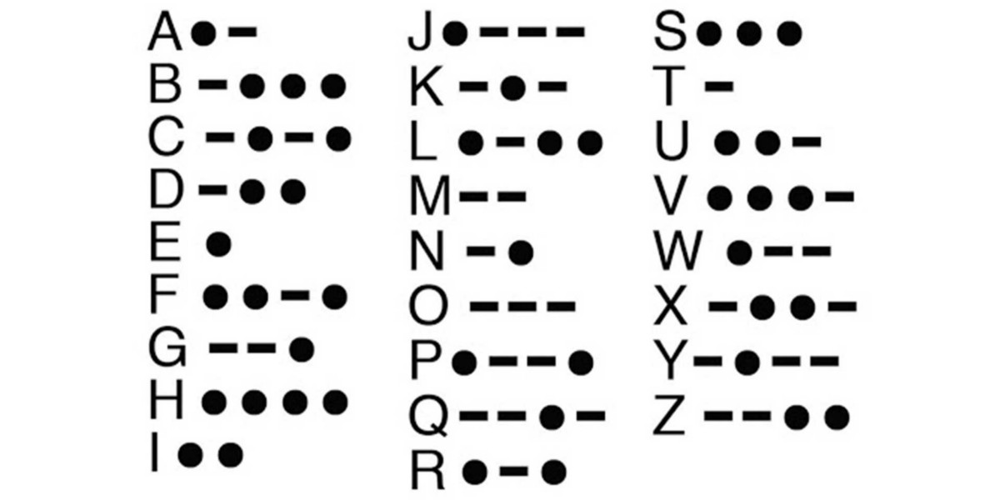

# Decode a Morse code message

> This project uses Ruby to decode morse code


## Getting Started

## Built With

- Ruby

## Getting Started

```cmd
git clone  git@github.com:Mhdez221993/decode_morse_code.git
```

## Authors

👤 **Author1**

- GitHub: [@Mhdez221993](https://github.com/Mhdez221993)
- Twitter: [@MoisesH42060050](https://twitter.com/MoisesH42060050)
- LinkedIn: [moises-hdez-coronado](https://www.linkedin.com/in/moises-hdez-coronado/)


## 🤝 Contributing

Contributions, issues, and feature requests are welcome!

Feel free to check the [issues page](../../issues/).

## Show your support

Give a ⭐️ if you like this project!

## Acknowledgments

- Hat tip to anyone whose code was used
- Inspiration
- etc

## 📝 License

This project is [MIT](./MIT.md) licensed.
